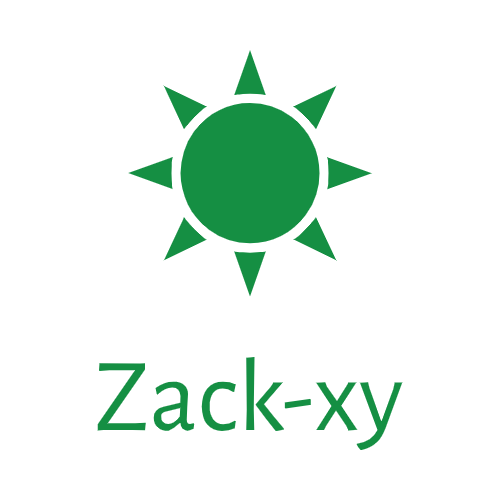

<h1 align="center">Hi, I'm Zack Zheng! :stars: </h1>

Hey there! :smile: My name is Zack Zheng. I'm a web developer and blogger from Dalian, China and currently reside in Shanghai. My dream is to be a Full Stack Developer and I want to contribute code to famous open source projects.I love to do web development and open to learning new technologies.
    

## 💻 Projects

<table>
  <thead align="center">
    <tr style="background-color:#B3DEE5">
      <th>Project</th>
      <th>Summary</th>
      <th>Technology</th>
    </tr>
  </thead>
  <tbody align="left">
    <tr>
      <th>
        <a href="https://github.com/zack-xy/vue3-bms" target="_blank">
        vue3-bms</a>
      </th>
      <th style="color: #FFA101">Background management system(Front End)</th>
      <th>
        
        
        
      </th>
    </tr>
    <tr>
      <th>
        <a href="https://github.com/zack-xy/vue3-bms-server" target="_blank">
        vue3-bms-server</a>
      </th>
      <th style="color: #FFA101">Background management system(Backend)</th>
      <th>
        
        
        
      </th>
    </tr>
    <tr>
      <th>
        <a href="https://github.com/zack-xy/vue-bms" target="_blank">
        vue-bms</a>
      </th>
      <th style="color: #FFA101">Background management system(Front End)</th>
      <th>
        
        
        
      </th>
    </tr>
    <tr>
      <th>
        <a href="https://github.com/zack-xy/o-bricks" target="_blank">
        o-bricks</a>
      </th>
      <th style="color: #FFA101">Micro projects, demos, examples, code snippets</th>
      <th>
        
        
        
      </th>
    </tr>
    <tr>
      <th>
        <a href="https://github.com/zack-xy/knownNet" target="_blank">
        knownNet</a>
      </th>
      <th style="color: #FFA101">My blog and notes</th>
      <th>
        
        
        
        
        
        
        
        
        
      </th>
    </tr>
  </tbody>
</table>

## :books: Technologies I'm Learning  
#### Software:

    

#### Front-end:

   

#### Back-end:

   

#### Editors and Operating Systems:

   

## 👋 Reach out to me 
-  zack_zhengxiyun@163.com
- https://twitter.com/zackzheng94
  

<a href="https://github.com/ZackZheng-xy">
  <!--  -->
  
</a>

